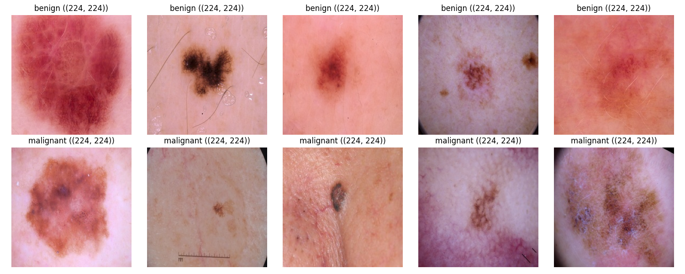

# 🔗 Decentralized Federated Learning for Skin Cancer Classification

> A server-free federated learning system where clients train together in a **peer-to-peer ring**, sharing model updates instead of patient images, to classify skin lesions from the ISIC dataset.


---

## 📖 Overview

Medical images are private and hard to share. This project trains a skin cancer classifier **without ever pooling the data in one place** and **without a central server**.

- 🏥 Each client keeps its own data locally
- 🔄 Clients pass model updates around a **decentralized P2P ring**
- 🧠 A **ResNet-18** model is trained collaboratively
- ⚖️ **FedProx** keeps training stable when each client's data is different (non-IID)
- 🛠️ Built with a **custom FL system**, not the Flower library

---

## 🚀 Key Features

- 🌐 **Decentralized P2P Ring**: no central aggregator, so no single point of failure
- 🔒 **Privacy-Preserving**: raw images never leave a client
- ⚖️ **FedProx Optimization**: handles uneven, non-IID client data
- 🩺 **Skin Lesion Classification**: ResNet-18 trained on the ISIC dataset
- 🧪 **Data Partitioning**: splits the dataset across simulated clients
- 📊 **Exploratory Data Analysis**: class distribution and sample visualisation
- 🖥️ **Simulation Script**: runs the full federated setup on one machine

---

## 🏗️ Architecture

<div align="center">
  
  <p><i>System architecture of the decentralized P2P ring</i></p>
</div>

1. Each client trains ResNet-18 on its **local** data using FedProx.
2. It sends its updated weights to its **neighbour** in the ring.
3. Neighbours combine the updates and continue training.
4. Repeat for several rounds until the shared model converges.

---

## 🛠️ Tech Stack

| Technology | Purpose |
|---|---|
| **Python** | Core language |
| **PyTorch** | Model training (ResNet-18) |
| **FedProx** | Federated optimization for non-IID data |
| **ISIC Dataset** | Skin lesion images |
| **Custom FL System** | Peer-to-peer ring communication and aggregation |

---

## 📂 Project Structure

```
Decentralized_FL/
├── clients/         # Client training logic
├── clients_data/    # Data partitions for each client
├── data/            # Dataset
├── incoming/        # Model updates received from peers
├── models/          # Model definitions (ResNet-18)
├── utils/           # Helper functions
├── eda.py           # Exploratory data analysis
├── partition_data.py# Splits data across clients
└── run_sim.py       # Runs the federated simulation
```

---

## 📸 Data Exploration



---

## 📱 Installation & Setup

### Prerequisites

- Python >= 3.9
- pip
- Git

### Setup Steps

```bash
git clone https://github.com/shriniha/Decentralized_FL.git
cd Decentralized_FL
python -m venv venv
source venv/bin/activate   # Windows: venv\Scripts\activate
pip install -r requirements.txt
```

### Run

```bash
python eda.py              # explore the dataset
python partition_data.py   # split data across clients
python run_sim.py          # run the decentralized FL simulation
```

> 📥 **Dataset:** the full ISIC dataset is available from the [ISIC Archive](https://www.isic-archive.com/). Place the images in the `data/` folder.

---

## 🔮 Future Work

- 🔐 Add differential privacy or secure aggregation
- 🌍 Test with more clients and different ring or mesh topologies
- 🏥 Evaluate on real, multi-hospital data

---

⭐ *If you like this project, drop a star!* ⭐
